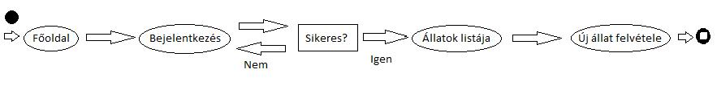

#Állatmenhely nyilvántartó rendszer

##Követelmények:

1. Követelmények összegyűjtése

    - Funkcionális elvárások
        + a rendszer az állatmenhely dolgozói számára készült, hogy jobban követni tudják a gondozott állatok állapotát, tartózkodási helyét
        + a rendszerben megtekinthető a gondozott állatok listája
        + a gondozó tudja módosítani a listát a következő lehetőségekkel: új állat felvétele, meglévő állat állapotának módosítása, állat törlése
    
    - Nem funkcionális elvárások
        + felhasználóbarát
        + biztonságos

2. Használatieset-modell
    - Szerepkörök:
        + vendég: kezdőoldal megtekintése, regisztráció
        + regisztrált felhasználó: állatok listájának megtekintése, új állat felvétele, állat szerkesztése (név, kenelszám, státusz), törlése
    
    - Használati eset diagram:
        
    
    - Folyamatok pontos menete:
         

##Tervezés

    
1. Oldaltérkép
    
    + Publikus:
        
        - főoldal
		- regisztráció
        - bejelentkezés
        
    + Felhasználó
        
        - állatok listjája
        - új állat felvétele
        - meglévő állat módosítása
        - meglévő állat törlése

2. Végpontok
	GET / főoldal
	GET /login bejelentkező oldal
	POST /login bejelentkezési adatok beküldése
	GET /login/signup regisztrációs oldal
	POST /login/signup regisztrációs adatok beküldése
	GET /animals/list állatok adatainak listázása
	GET /animals/new új állat felvételének űrlapja
	POST /animals/new új állat adatainak beküldése
	GET /animals/edit/name meglévő állat adatainak szerkesztése
	POST /animals/edit/name meglévő állat módosított adatainak beküldése
	GET /animals/remove/name meglévő állat törlése

        

3. Oldalvázlatok
    
    
    
    
    

4. Osztálymodell
    - Adatmodell
    
        

    - Adatbázisterv
    
        
        
    - Állapotdiagram
    
        

##Implementáció
1. Fejlesztői környezet bemutatása
    Cloud9 webes IDE, új workspace létrehozása után feltelepítetjük a szükséges modulokat. A Cloud9 segítségével egy fájlt tudunk futtatni webes terminálablakból.
    
2. Könyvtárstruktúrában lévő mappák funkiójának bemutatása
    - config: a waterline konfigurációja
    - controllers: vezérlő, folyamatok irányítása, kérések fogadása és feldolgozása
    - models: adatok, modell definiálása, feldolgozás logikája
    - viewmodels: nézetmodel 
    - views: az egyes oldalak kinézetét adja meg
    - node_modules: node js-hez telepített modulok
    - public
   
    
	

##Tesztelés

	- A tesztelést Windows 8.1 operációs rendszeren, Mozilla Firefox 41.0.2-ben végeztem, Selenium IDE használatával
	- Hozzáadtam a listához egy új állatot, státuszát módosítottam, majd töröltem
	- A teszt az alábbi eredménnyel zárult

	
